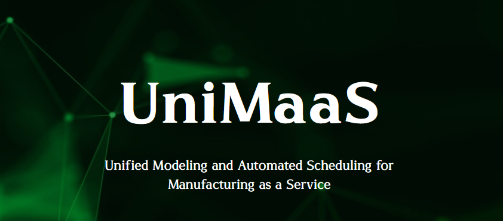

# UniMaaS Project

  

## Project Information
UniMaaS is a  RIA (Research and Innovation Action) project funded by the Horizon Europe programme under the topic "Manufacturing as a Service: Technologies for customised, flexible, and decentralised production on demand." UniMaaS's vision is to develop a platform with advanced technologies to offer flexible and decentralized manufacturing resources and supply chains as a service to European SMEs and industries. To realize this vision, the proposed platform will deploy 3 integrated Suites: (i) Data Modelling Suite: offering manufacturing dataspaces, cloud-based resource monitoring, trusted cross-company data exchange and digital product passport, (ii) Modelling Suite: offering modular modeling of manufacturing resources, intent-based servitization , AI-based estimations and Zero-X analysis, and (iii) Decision-Making Suite: offering scheduling and planning of manufacturing resources, circularity and sustainability optimization. The platform will adopt advanced digital technologies such as cloud computing, digital twins and trustworthy AI, as key enablers towards fulfilling its objectives. UniMaaS platform will provide easy access to customized manufacturing service chains and will support the entire life-cycle management of processes and products. The UniMaaS Suites and the Platform will be demonstrated in 4 Pilots including aircraft maintenance, automotive seating, 3D construction printing, and logistics/warehouse management.

## CI/CD Services

* [Jenkins](https://jenkins.unimaas.rid-intrasoft.eu/) : CI/CD Automation Server
* [Harbor](https://harbor.unimaas.rid-intrasoft.eu) : Container Image Registry
* [Portainer](https://portainer.unimaas.rid-intrasoft.eu) : Container Management System
* [CI/CD Documentation](https://github.com/SafeTravellers-Project/cicd-documentation) : CI/CD Stack Documentation Repository TO BE CHANGED

## Website and Social Media

* [UniMaas Website](https://unimaas-project.eu/)
* [LinkedIn](https://www.linkedin.com/company/unimaas/)
